# 工具链安装

## VS Code 配置

### 1.扩展安装

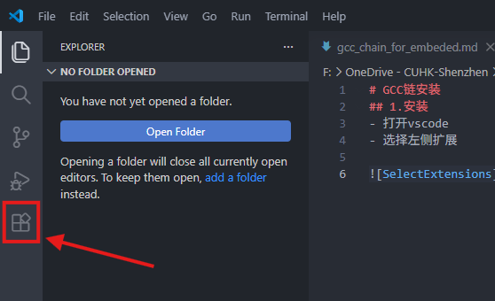

搜索安装以下扩展：

- `C/C++`
- `Embedded IDE`

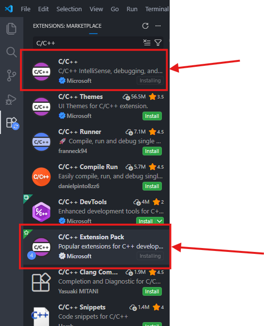

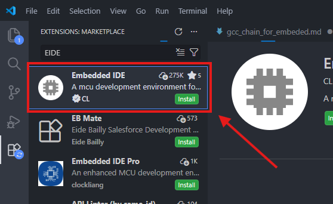

---

### 3.配置 EIDE

- 进入 EIDE 插件，打开 `OPERATIONS`

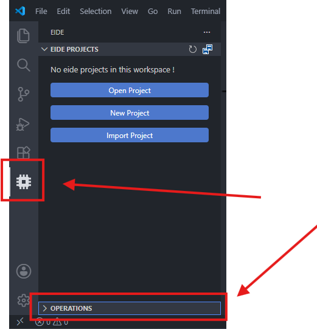

- 选择 `Setup Utility Tools`

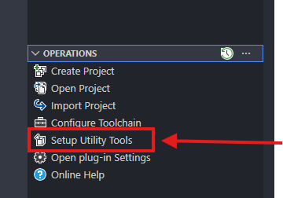

- 安装：
  - `GNU Arm Embedded Toolchain`
  - `OpenOCD Programmer`

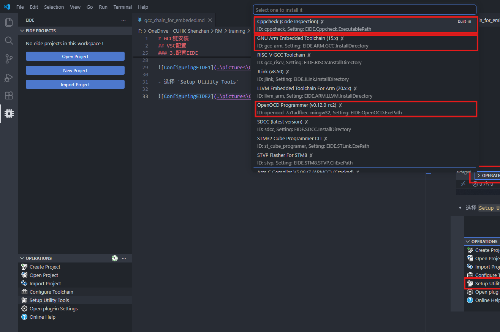

---

### 4.测试

- 打开测试程序文件夹`Test` 中的 `Test.code-workspace` 工作区
- 进入EIDE
- 选择 `Rebuild`
- 显示编译完成即表示配置完成

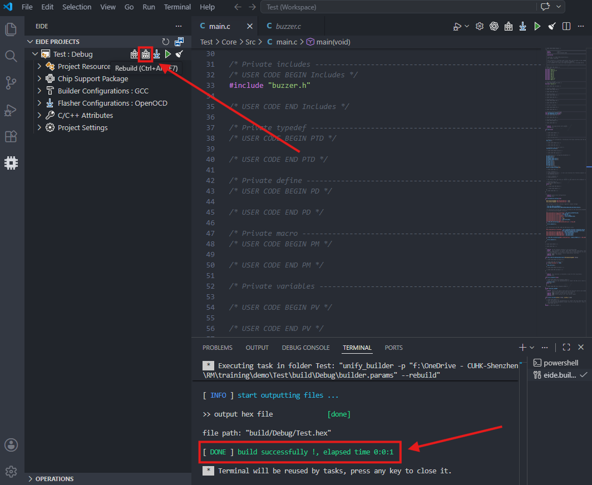

## STM32CubeMX 安装

### 1. 安装

- 下载对应系统的安装包：[安装包地址](https://dragopass.feishu.cn/drive/folder/D4WJfel9XlaZ0xdvafMc5jP5nqw)（网页密码：`8742&92k`）

### 2. 异常卡住

- 有时候可能会卡住无法退出，可以用任务管理器关闭

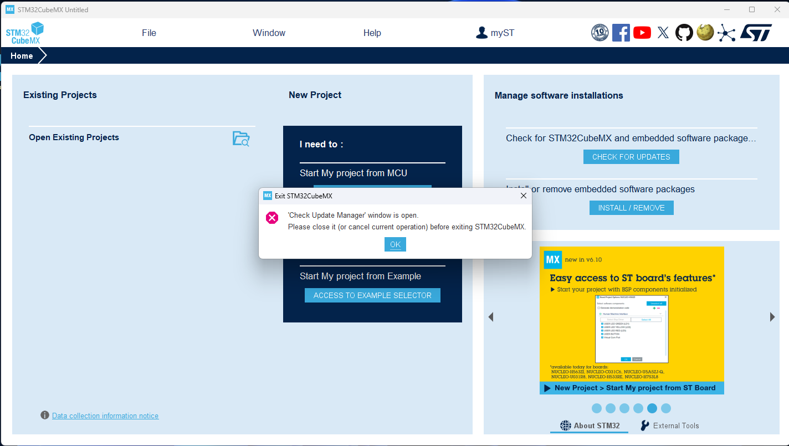
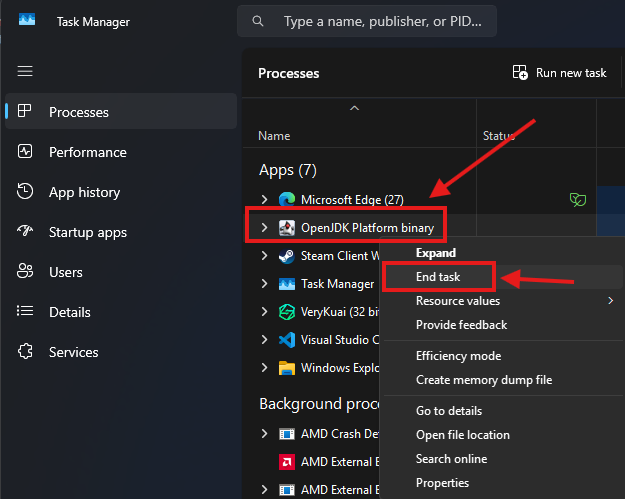

### 3. 更新（If needed）

- 用管理员模式打开 STM32CubeMX
- 点击 `Check For Updates`
- 选择最新更新

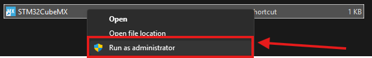

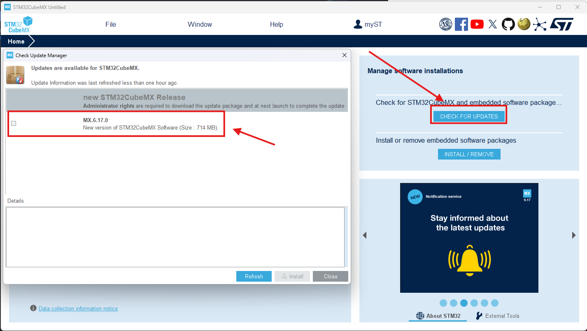

- 部分老旧版本更新需要注册账号，建议直接下载链接提供的版本
