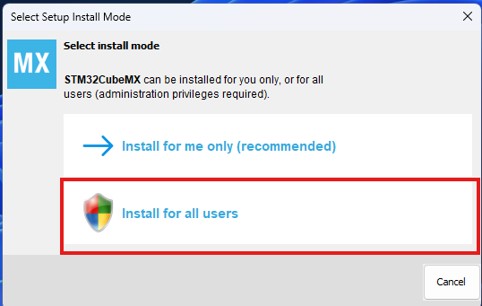

# 工具链安装

## VSC配置

### 1.安装C语言服务
- 打开vscode
- 选择左侧扩展

- 搜索 `C/C++`
- 选择 `C/C++`
- 点击安装

---

### 2.安装EIDE插件
- 搜索`EIDE`
- 选择`Embedded IDE`
- 点击安装

---

### 3.配置EIDE
- 进入EIDE插件
- 选择`OPERATIONS`

- 选择 `Setup Utility Tools` 

- 安装 `GNU Arm Embedded Toolchain` `OpenOCD Programmer`

- 重启VSC

---

### 4.测试
- 打开测试程序文件夹`Test` 中的 `Test.code-workspace` 工作区
- 进入EIDE
- 选择 `Rebuild`
- 显示编译完成即表示配置完成

## 安装STM32CubeMX

### 1.安装

- [安装包地址](https://dragopass.feishu.cn/drive/folder/D4WJfel9XlaZ0xdvafMc5jP5nqw) 密码 `8742&92k`
- 下载对应系统的安装包
- 双击安装包
- 选择为所有用户安装

- 下一步
- 选择安装路径(用户自定义)

- 一直下一步直到安装
- 等待安装

- 打开STM32CubeMX
- 点击右上角退出STM32CubeMX
- 第一次打开无法退出是正常的，需要用任务管理器关闭

### 更新(If needed)

- 用管理员模式打开STM32CubeMX
- 点击 `Check For Updates`
- 选择最新更新

- 部分老旧版本更新需要注册账号，建议直接下载链接提供的版本