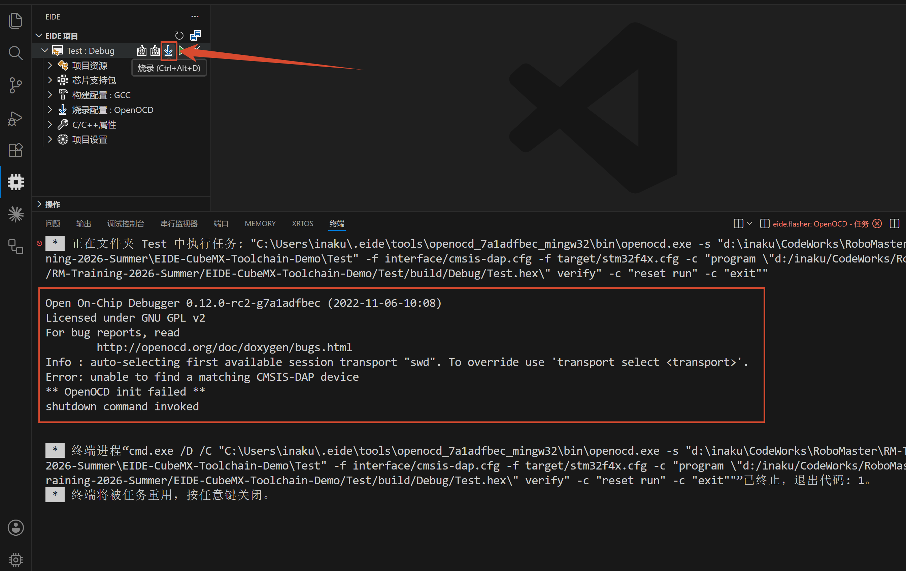
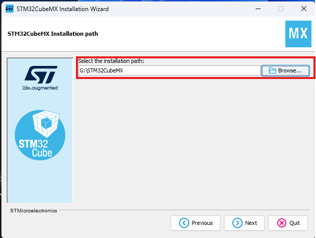

# 工具链安装

## VS Code 配置

### 1. 扩展安装

搜索安装以下扩展：

- `C/C++`
- `Embedded IDE`（EIDE）

---

### 3. 配置 EIDE

- 进入 EIDE，打开 `OPERATIONS`

- 选择 `Setup Utility Tools`

- 安装：
  - `GNU Arm Embedded Toolchain`
  - `OpenOCD Programmer`

---

### 4. 示例项目测试

#### 构建测试

- 打开测试程序文件夹 `Test` 中的 `Demo.code-workspace` 工作区
- 进入 EIDE
- 选择 `Rebuild`
- 显示编译完成即表示配置完成

#### 烧录测试

由于没有烧录器和开发板，烧录会失败。本次只测试驱动配置是否完成。

- 点击 `Flash`，如果显示如下图所示的错误提示，说明驱动配置完成。

## STM32CubeMX 安装

### 1. 安装

- 下载对应系统的安装包：[安装包地址](https://dragopass.feishu.cn/drive/folder/D4WJfel9XlaZ0xdvafMc5jP5nqw)（网页密码：`8742&92k`）

### 2. 更新（If needed）

- 用管理员模式打开 STM32CubeMX
- 点击 `Check For Updates`
- 选择最新更新

- 部分老旧版本更新需要注册账号，建议直接下载链接提供的版本

### 3. 示例项目测试

- 用 STM32CubeMX 打开 `Test` 目录中的 `.ioc` 文件
- 成功后如下图所示：

### 4. 异常卡住

- 有时候可能会卡住无法退出，可以用任务管理器关闭

